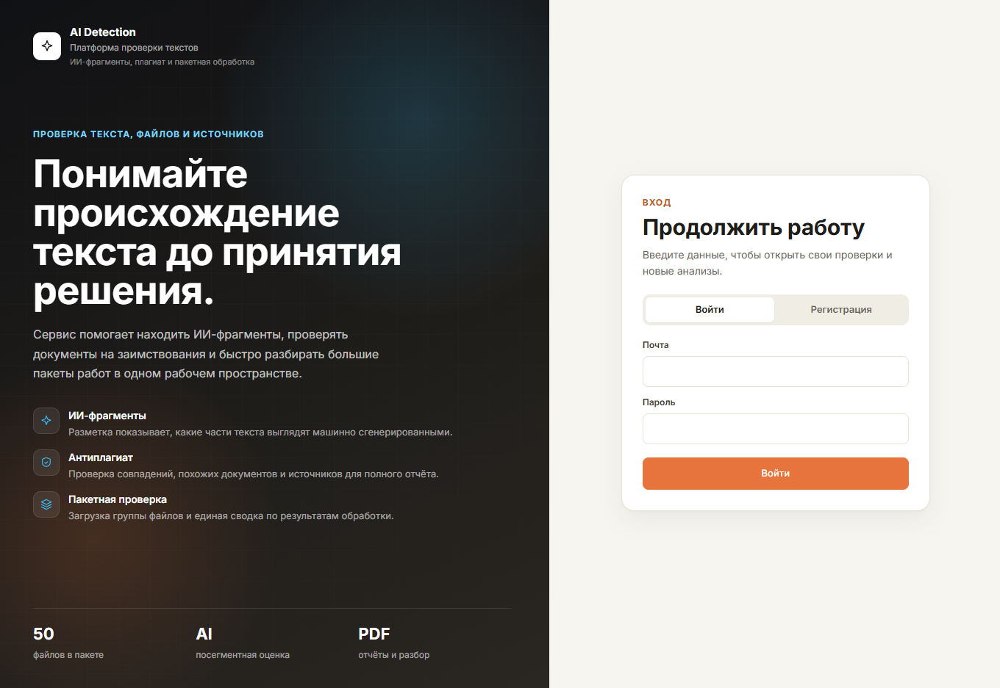
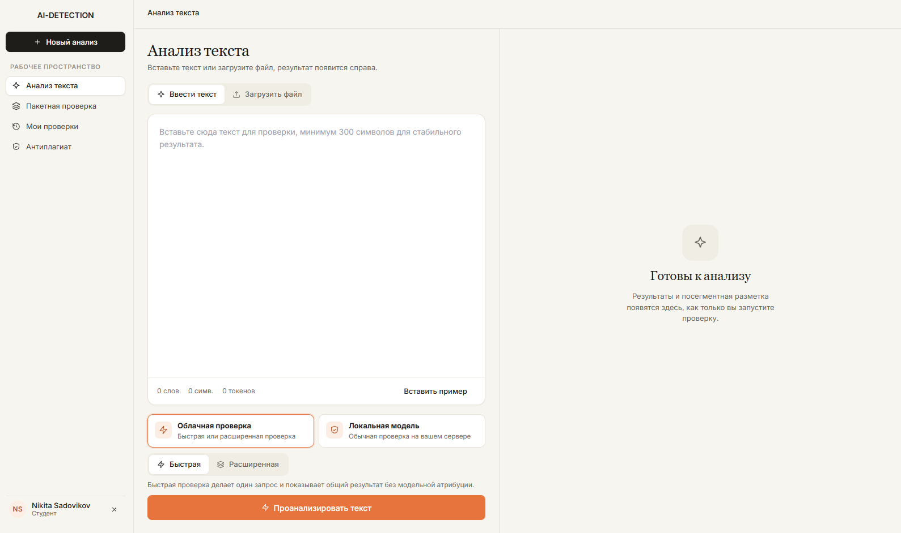
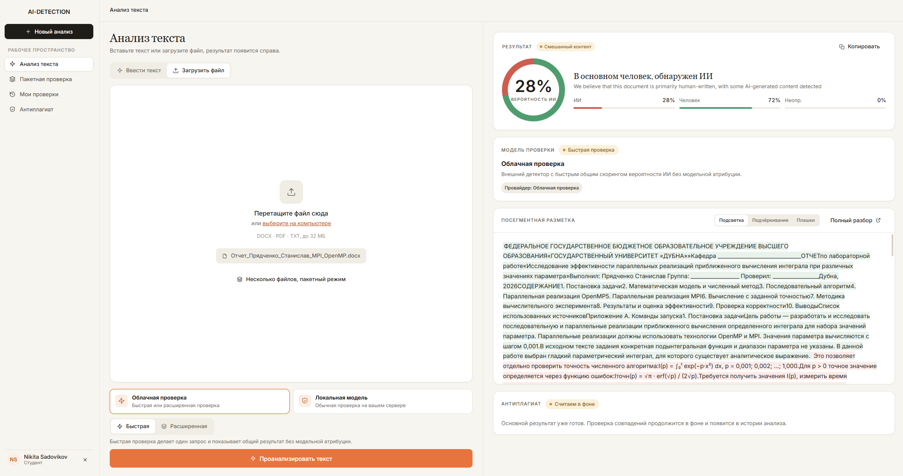
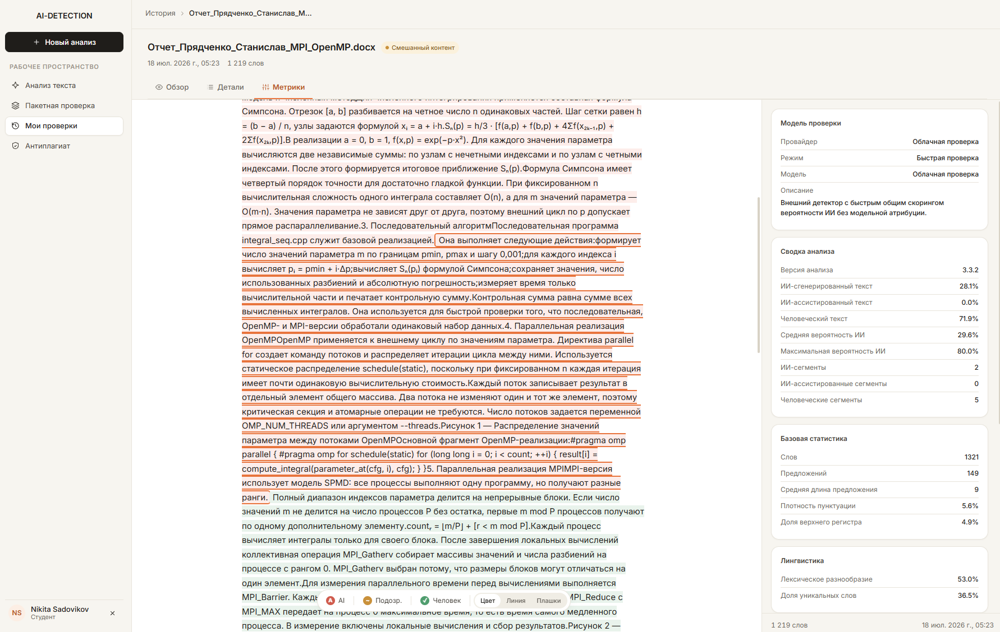
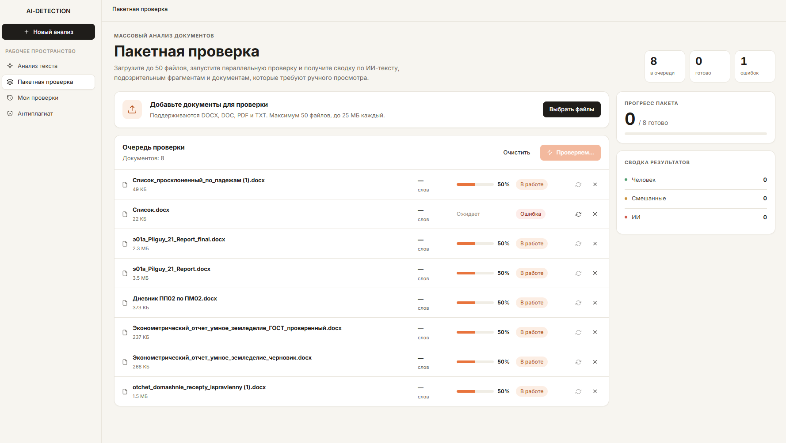
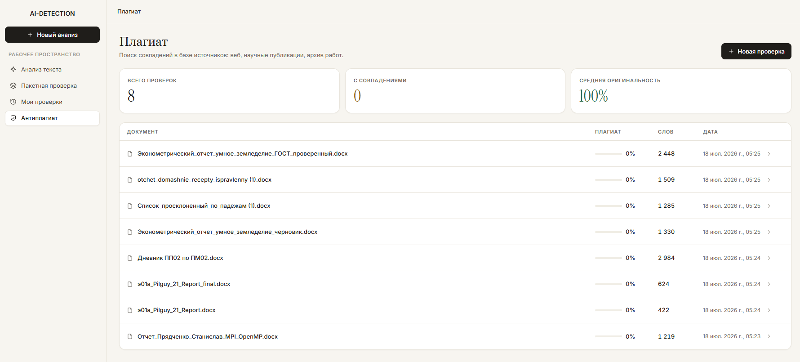

# AiDetection Frontend

SPA для проверки текстов и документов на ИИ-генерацию и плагиат.  
Стек: **Vue 3 + TypeScript + Vite + Pinia + Vue Router + PrimeVue + Tailwind**.

Скриншоты лежат в [`screens/`](./screens/).

---

## Экраны

### Вход / регистрация

Split-layout: слева ценностное предложение (AI-фрагменты, антиплагиат, пакетная проверка), справа форма входа с переключением «Войти / Регистрация».



### Анализ текста — пустое состояние

Рабочее пространство: сайдбар по ролям, ввод текста или файла, выбор **облачной / локальной** модели, режимы «Быстрая / Расширенная», счётчики слов/символов/токенов. Справа — empty state до запуска проверки.



### Результат проверки

Двухколоночный layout: слева документ и настройки, справа вердикт (donut + доли AI/Human), модель проверки, посегментная разметка с подсветкой ИИ-фрагментов, статус фонового антиплагиата.



### Детали проверки (история)

Карточка анализа: breadcrumb, табы «Обзор / Детали / Метрики», подсветка сегментов (AI / подозрительные / человек), режимы отображения (цвет / линия / плашки), сводка и лингвистические метрики.



### Пакетная проверка

Очередь до 50 файлов, статусы «Ожидает / В работе / Ошибка», прогресс по строкам, сводка пакета (в очереди / готово / ошибки) и распределение вердиктов.



### Антиплагиат

Список проверок: метрики «всего / с совпадениями / средняя оригинальность», таблица документов с % плагиата и переходом в детальный отчёт.



---

## Архитектура

```
src/
├── views/           # Страницы маршрутов
├── components/      # workspace, history, plagiarism, common
├── services/        # api.ts, auth.ts — Axios + JWT
├── stores/          # Pinia (aiDetection)
├── types/           # REST-контракт
├── utils/           # вердикты, display
├── router/          # auth / role guards
└── assets/          # Tailwind, SCSS, Veritas tokens
```

**Поток:** View → Pinia / AuthService → Axios (`VITE_API_BASE_URL`) → Flask API.

| Файл | Зачем |
|------|--------|
| `services/api.ts` | Анализ, история, плагиат; Bearer из `localStorage` |
| `services/auth.ts` | Login/register, роли, стартовый маршрут |
| `stores/aiDetection.ts` | Loading/error, text/file/batch, фильтры истории |
| `router/index.ts` | `requiresAuth`, `requiresGuest`, `requiresRole` |

---

## Роли и маршруты

| Роль | Старт | Доступ |
|------|--------|--------|
| `student` | `/` | анализ, история, плагиат, профиль |
| `teacher` / `admin` | `/batch` | то же + пакетная проверка |
| `developer` | `/` | плюс `/detector` |

| Путь | Экран |
|------|--------|
| `/auth` | Вход / регистрация |
| `/` | Анализ текста / файла |
| `/batch` | Пакетная проверка |
| `/history` | Мои проверки |
| `/analysis/:id` | Детали анализа |
| `/plagiarism`, `/plagiarism/:id` | Антиплагиат |
| `/profile` | Профиль |
| `/detector` | Инструменты разработчика |

---

## UX-решения

- Единая оболочка `VeritasShell`: сайдбар + рабочая зона
- Состояния: empty → loading → результат / ошибка
- Облако (Pangram) и локальный RuBERT в одном UI
- Посегментная разметка ИИ с переключением режимов подсветки
- Антиплагиат в фоне после основного вердикта
- Пакетная очередь со статусами и сводкой
- Мобильные карточки для истории / анализа / плагиата

---

## Env

```env
VITE_API_BASE_URL=http://127.0.0.1:5000
VITE_API_KEY=local-docker-key
```

`VITE_*` вшиваются на build. В Docker — через `ARG` в `Dockerfile`.

| Режим | `VITE_API_BASE_URL` |
|-------|---------------------|
| `npm run dev` | `http://127.0.0.1:5000` |
| Docker compose | `http://localhost:5000` |
| Prod (Caddy) | `/api` |

---

## Запуск

### Локально

```sh
npm install
npm run dev
```

→ http://localhost:5173 (нужен backend на `:5000`)

### Docker (из корня monorepo)

```sh
docker compose up --build
```

| Сервис | URL |
|--------|-----|
| Frontend | http://localhost:8080 |
| Backend | http://localhost:5000 |

Админ по умолчанию: `admin@aidetection.local` / `admin123`

Скрипты: `npm run build` · `npm run type-check` · `npm run lint`

---

## Ограничения

- Админ-UI пользователей/групп на фронте нет
- История только своих проверок (журнала группы нет)
- Локальная модель — pilot; нужен `ml-service`
